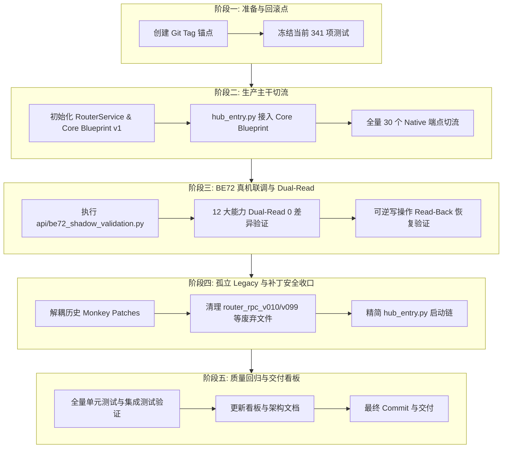

# Router Core v1 全面生产迁移与 Legacy 收口任务纲领

**基线分支**: `refactor/router-core-v1`  
**基线回滚锚点**: Tag `v0.10.12-pre-router-core-cutover` (Commit `99581bd`)  
**当前状态基准**: 341 tests passed in 10.21s (100% pass, 0 failed, 0 skipped)  
**文档性质**: 最终生产切流、真实硬件联调、Legacy 收口与架构归一的主执行基准文档  

---

## 一、当前真实状态基线 (Reality Baseline)

经过现实运行时与代码审计，确认当前系统处于以下精确状态：

1. **Router Core 代码实现已就绪，但生产切流尚未发生**:
   - `router_core` 核心模块（`ReyeeSessionManager`, `ReyeeRpcClient`, `ReyeeEWebDriver`, `RouterService`, `RouterCache`, `RouterRealtimeEngine`, `create_router_blueprint_v1`）已完整实现并覆盖单元测试。
   - `hub_entry.py` 生产启动链路当前依然注册 `create_router_blueprint_v010` 和 `create_ipv6_blueprint`，生产流量目前 **100% 走 Legacy 路径**。
2. **74 个 App 契约端点流向现状**:
   - **Router Core 实际生产服务数量**: **0**
   - **Legacy Blueprint 实际生产服务数量**: **30** (全部 30 个 Router Native 端点)
   - **LabRelay Extension 端点数量**: **25** (6 LabProbe DDNS + 7 Portmaps + 5 STUN + 3 WireGuard + 4 Firewall Automation)
   - **Hub 核心/元数据端点数量**: **19** (设备列表、版本、增量同步、WOL 等)
   - **禁止迁入 Reyee Driver 的端点总数**: **44** (25 Extension + 19 Hub Core)
3. **真机验证工具就绪**:
   - 已建立 Fail-Closed 安全机制的 BE72 真机验证脚本 `api/be72_shadow_validation.py`，支持动态 Key 提取、AES 加密、Wire RPC、Single-Flight 登录与可逆写操作门禁。
4. **质量与测试基准**:
   - Hub 现有 341 项测试 100% 全绿，App 契约 0 漂移。

---

## 二、核心任务目标 (Core Objectives)

### 1. Router Core 真实接管 Hub 生产路径
- 将 `hub_entry.py` / `hub.py` 的路由注册主干从 `create_router_blueprint_v010` / `router_rpc_v099` 切换至 `create_router_blueprint_v1`。
- 由 `RouterService` 统一承载 30 个 Router Native 端点，对外提供完全等价的 `{"data": ...}` 响应封装、Query 参数处理（如 `force=1`）及精确错误状态码。

### 2. 完成真实 BE72 / ReyeeOS 联调验证
- 不仅依赖 Mock 和单元测试，必须在 live BE72 / ReyeeOS 硬件环境下完成闭环验证：
  - 动态 Key 提取与 OpenSSL-compatible `EVP_BytesToKey(MD5)` AES-256-CBC 鉴权
  - SID + Cookie 传输机制
  - `/api/cmd` 原生 Wire RPC 执行
  - Idle Session 复用与 Single-Flight 并发独占防重复登录
  - Session 失效时单次自动重试（防止无限重试死循环）
  - Dual-Read 字段级对比（Legacy vs RouterCore）
  - 安全可逆写操作（`read before -> write -> read-back -> restore -> read after`）
- 发现问题**直接修复新架构**，不维持无意义的妥协兼容。

### 3. 架构归一与单一职责收口 (Single Source of Truth)
彻底消除历史演进中形成的多层套娃（`Router Core -> Adapter -> Legacy -> Patch -> router_rpc_v010`），使每项系统职责只有一套正式实现：
- **Session 管理**: 仅由 `router_core.driver.reyee_session.ReyeeSessionManager` 承载
- **RPC 通信**: 仅由 `router_core.driver.reyee_rpc.ReyeeRpcClient` 承载
- **硬件驱动**: 仅由 `router_core.driver.reyee.ReyeeEWebDriver` 承载
- **SWR 缓存**: 仅由 `router_core.cache.router_cache.RouterCache` 承载
- **实时遥测与 WSS**: 仅由 `router_core.realtime.router_realtime.RouterRealtimeEngine` 承载
- **长任务管理**: 仅由规范化 Task 模块承载
- **Router API 路由**: 仅由 `router_core.service.blueprint.create_router_blueprint_v1` 承载

### 4. 彻底清理已替代的 Legacy 代码与 Monkey Patches
在新架构稳定接管并经测试/真机验证后，全量下线并删除被完全替代的历史补丁与文件：
- `router_rpc_v010.py` / `router_rpc_v099.py` / `router_rpc.py`
- `router_be72_auth_patch.py` / `router_be72_sid_wire_patch.py`
- `router_http_developer_transport_patch.py` / `router_developer_flow_patch.py`
- `router_slow_cache_patch.py` / `router_fast_watchdog_patch.py`
- `router_ws_passive_fix.py` / `router_ws_patch.py`
- `router_status_localization` / `router_compat.py`
- 历史废弃的临时调度器与兼容桥接层

---

## 三、不变约束与核心资产边界 (Hard Boundaries & Retained Assets)

### 1. LabRelay 自研核心能力绝对保留 (KEEP)
以下产品核心自研资产必须 100% 完整保留，不得误删、弱化或混淆入 Reyee 官方驱动：
- **LabProbe DDNS**: 多 Provider 适配（AliDNS, DNSPod, Cloudflare, dynv6, DuckDNS, deSEC, Dynu, IPv64）、记录管理、TTL、退避与公网地址探测（*LabProbe DDNS 与 Router Native DDNS 严格独立并存*）
- **6→4 / 6→6 端口映射**: 核心 Relay、TCP/UDP 转发、端口映射持久化、IPv6 Suffix + MAC 动态目标绑定（*LabProbe Port Mapping 与 Router Native Port Mapping 严格独立并存*）
- **STUN 穿透**: STUN TCP/UDP 探测、NAT 类型判定、NAT Keepalive 活性维持、公网端点生命周期
- **WireGuard VPN**: Router 端私钥本地生成与安全隔离、Generic Netlink 集成、Endpoint Profiles 多策略切换
- **网络拓扑与设备遥测**: IPv6 Neighbor 发现、设备在线状态判定、实时流量统计
- **Extension 运维**: Agent Presence、版本热更新（Update）、残留清理（Cleanup）、Doctor 诊断
- **进程拓扑**: 单二进制 `/usr/bin/labrelay`，双进程拓扑 `labrelay agent` ↔ `/tmp/labrelay.sock` ↔ `labrelay daemon` 严格保持

### 2. 数据与凭据安全绝不破坏
- 严格保护 Hub SQLite 数据库、DDNS 域名配置、DNS Provider API Key/Secret、端口映射持久化规则、WireGuard 密钥对及路由器现有配置。
- 路由器密码、动态 Key、SID、Cookie 绝不下发 App 端，日志中严格脱敏。
- 所有真机写测试必须通过 `read-back -> restore` 保证 100% 可逆。

### 3. 性能与实时体验指标
- **Dashboard 响应**: 命中 SWR 缓存时 $< 5\text{ms}$，冷启动 Single-Flight 聚合 $< 350\text{ms}$。
- **Device 实时性**: 保持高频增量分发，不引入慢速全量轮询。
- **WSS 稳定性**: 维持 Hub 服务端 `3.0s` 空闲 keepalive 广播，完全兼容 App 端 `10s ping / 1s check / 45s frame timeout` 看门狗。
- **RPC 调用量**: 依靠 SWR 与 Single-Flight 机制，Router RPC 调用频次必须 $\le$ 基线水平，杜绝请求堆积。

### 4. App-Hub 契约原则
- 原则上保持 `docs/contracts/app-hub-contract-v1.json` 契约零破坏（0 Diff）。
- 项目目前为内部专属使用，如发现确属严重阻碍新架构的历史坏设计，允许 App + Hub 同步修正，不背负虚假历史包袱。

---

## 四、实施阶段与演进路线 (Execution Phases)

---

## 五、验收门禁与 STOP 条件 (Gate Criteria & STOP Conditions)

### 1. 阶段验收门禁 (Exit Criteria)
- [ ] **生产切流完成**: `hub_entry.py` 直接注册 `create_router_blueprint_v1`，生产环境 30 个 Native 端点由 Router Core 接管。
- [ ] **真机验证通过**: BE72 / ReyeeOS 真实硬件联调成功，动态 Key、AES-256-CBC、SID 复用、Single-Flight 独占锁通过，Dual-Read 0 结构差异。
- [ ] **可逆写测试通过**: UPnP / 防火墙等写操作成功触发，Read-back 吻合，Restore 后完全复原。
- [ ] **冗余代码清理完毕**: 废弃的 `router_rpc` 旧版本和 10+ 处 monkey patches 彻底移除，无未使用的死代码。
- [ ] **自研核心资产完好**: LabProbe DDNS、6→4/6→6 映射、STUN、WireGuard、双进程拓扑 100% 正常运行。
- [ ] **测试套件全绿**: 全量测试（$\ge 341$ 项）100% 通过，无回归。
- [ ] **代码结构显著简化**: 启动链与依赖拓扑单向清晰。

### 2. 强制 STOP 条件
若在实施过程中触发以下任一情况，立即停止自动执行并报告：
1. 出现可能导致现有 DDNS、端口映射、WireGuard 配置或用户数据丢失的操作。
2. 出现可能导致路由器陷入不可管理状态、死循环重启或不可逆配置修改的操作。
3. 发现无法在保留 LabRelay 自研核心能力（DDNS / 6to4 / STUN / WireGuard）的前提下完成重构。
4. 发现新架构在硬件底层协议或安全边界上存在方向性冲突。
