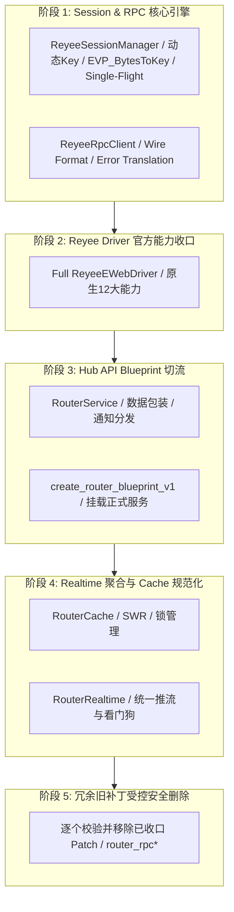

# Router Core v1 自主重构与迁移施工全景方案

**基线分支**: `refactor/router-core-v1`  
**冻结契约**: [`docs/contracts/app-hub-contract-v1.json`](file:///d:/Github/labprobe-hub/docs/contracts/app-hub-contract-v1.json) (74 REST + 8 WSS)  
**参考基准**: [`api/aes.js`](file:///d:/Github/labprobe-hub/api/aes.js), [`api/api_test_all.js`](file:///d:/Github/labprobe-hub/api/api_test_all.js)  
**生成日期**: 2026-08-24  

---

## 一、Phase 1 后真实架构与剩余技术债分析

### 1.1 当前架构现状
在 Phase 1 中，已成功建立 `router_core` 架构骨架：
- `router_core/contracts.py`: 数据契约与模型
- `router_core/errors.py`: 统一异常与错误分类
- `router_core/driver/base.py`: 抽象 Driver 接口
- `router_core/driver/reyee.py`: `ReyeeEWebDriver` (Legacy Adapter)
- `router_core/service/router_service.py`: `RouterService` 业务服务层
- `router_core/session/interface.py`: Session 抽象接口
- `router_core/extension/interface.py`: LabRelay Extension 边界接口

### 1.2 剩余技术债清单
1. **认证与 RPC 分散**: 认证逻辑散落在 `router_developer_flow_patch.py`、`router_be72_auth_patch.py`、`router_be72_sid_wire_patch.py`、`router_http_developer_transport_patch.py` 以及历史 `router_rpc*.py` 中。
2. **三套 router_rpc 历史文件**: `router_rpc.py`, `router_rpc_v099.py`, `router_rpc_v010.py` 并存且存在多处猴子补丁层叠。
3. **SWR Cache 与 Priority Actor 耦合**: 缓存、锁与调度散落在多个 patch 文件中。
4. **Realtime 聚合链路分散**: 官方 `/ws` 处理、设备实时速率聚合以及 Hub `/api/realtime/ws` 广播存在冗余序列化与多次缓存拷贝。

---

## 二、架构演进依赖关系图



---

## 三、分阶段自主迁移实施计划

### 阶段 1: ReyeeSessionManager 与 ReyeeRpcClient 正式实现 (核心基石)
- **目标**: 将动态 Key 提取、OpenSSL/GibberishAES 兼容加密、`/api/auth` 登录、CookieJar/SID 管理、Idle Timeout 维护、Single-Flight 独占重登录与 RPC Wire 通信在 `router_core/session/` 和 `router_core/driver/` 中正规化实现。
- **迁移对象**: 提炼并取代 `router_developer_flow_patch`、`router_be72_auth_patch`、`router_be72_sid_wire_patch` 中的底层核心逻辑。
- **测试保障**:
  - 固定 Salt 确定性测试向量与 `aes.js` 逐字节对照测试。
  - 并发 50+ 请求触发 401 时的 Single-Flight 独占登录验证（只触发 1 次真实登录）。
  - 会话自动刷新与至多 1 次重试验证。
  - 密码错误熔断防死循环测试。
- **回滚策略**: `ReyeeEWebDriver` 继续允许 fallback 到 legacy client。

### 阶段 2: ReyeeEWebDriver 官方能力全量实现 (Driver 收口)
- **目标**: 在 `ReyeeEWebDriver` 内部直接调用 `ReyeeRpcClient` 实现 12 大路由器原生管理功能：
  - `capabilities`, `status`, `dashboard`, `devices`
  - `port-mapping` (原生端口映射 CRUD)
  - `upnp` (开关与状态查询)
  - `firewall` (规则 CRUD、启停 PATCH、重排序 REORDER)
  - `ddns` (原生 DDNS CRUD)
  - `ipv6` (status, config, clients, save)
  - `diagnostic` (读取与触发)
- **迁移对象**: 吸收 `router_native_features_patch.py` 与 `router_ipv6.py` 中的原生路由操作。
- **测试保障**:
  - 新旧 Driver 输出逐字段对比测试 (Field-level equivalence)。
  - 验证单次业务请求的底层 RPC 次数 $\le$ 旧实现。
  - 错误代码与消息映射 100% 一致性测试。

### 阶段 3: Hub Router Blueprint 正式切流至 RouterService
- **目标**: 在 `hub_entry.py` 中，将 `/api/router/*` 端点注册正式切换为由 `RouterService(ReyeeEWebDriver)` 驱动的 `create_router_blueprint_v1`。
- **迁移对象**: 替换 `create_router_blueprint_v010` 生产挂载点。
- **安全保障**:
  - 严格保持 74 个 REST 端点 URL、方法、Query 参数、Request 键、Response `{"data": ...}` 结构 0 漂移。
  - 触发 `test_contracts_guard.py` 全量契约看门狗测试。
  - 保留 Legacy Path 开关以便毫秒级回滚。

### 阶段 4: RouterRealtime 聚合层与 RouterCache 规范化
- **目标**: 将路由性能采集（官方 `/ws` + SWR 缓存）与终端设备速率流统一汇聚到 `RouterRealtime` 模块，向 `/api/realtime/ws` 广播 8 大标准 Frame。
- **性能门禁**:
  - 维持 App 侧 10s ping / 1s check / 45s frame timeout 看门狗契约。
  - 维持 1 秒级推流频率，消除重复采样与重复 JSON 序列化开销。
  - HTTP 实时接口维持仅用于冷启动/重连校准。

### 阶段 5: 冗余旧代码与 Patch 安全清理 (NO PROOF = NO DELETE)
- **目标**: 针对被完全吸收且有 100% 测试覆盖的旧文件进行受控清理。
- **删除准入条件**:
  1. 新实现已在 Stage 1-4 稳定接管。
  2. 全量 pytest 100% 通过（无 skipped/failed）。
  3. 运行时调用链追踪证明无任何活跃代码引用该 patch。
- **最终预计保留**:
  - LabRelay Extension 核心资产 (6to4, 6to6, STUN, WireGuard, LabProbe DDNS, Agent Update/Cleanup, 双进程模型) 100% 完好保留。

---

## 四、最终目标文件结构

```
d:\Github\labprobe-hub├── router_core/
│   ├── __init__.py
│   ├── contracts.py                # 74 REST + 8 WSS 契约与模型
│   ├── errors.py                   # 统一错误与 HTTP 响应映射
│   │
│   ├── driver/
│   │   ├── __init__.py
│   │   ├── base.py                 # RouterDriver 抽象基类
│   │   ├── reyee.py                # ReyeeEWebDriver 正式实现
│   │   ├── reyee_session.py        # ReyeeSessionManager (Single-Flight/AES)
│   │   └── reyee_rpc.py            # ReyeeRpcClient (Wire通信)
│   │
│   ├── service/
│   │   ├── __init__.py
│   │   ├── router_service.py       # RouterService 领域业务层
│   │   └── blueprint.py            # Hub API Router Blueprint v1
│   │
│   ├── cache/
│   │   ├── __init__.py
│   │   └── router_cache.py         # SWR 缓存与锁管理
│   │
│   ├── realtime/
│   │   ├── __init__.py
│   │   └── router_realtime.py      # Realtime 统一聚合分发层
│   │
│   ├── tasks/
│   │   ├── __init__.py
│   │   └── task_manager.py         # 异步诊断/升级任务管理
│   │
│   └── extension/
│       ├── __init__.py
│       └── interface.py            # LabRelay Extension 契约边界 (KEEP)
│
├── labrelay/                       # Rust Extension 资产 (KEEP)
├── lab_ddns.py                     # LabProbe 自研 DDNS 服务 (KEEP)
├── stun_service.py                 # STUN 穿透服务 (KEEP)
├── wireguard_service.py            # WireGuard 服务 (KEEP)
├── firewall_automation.py          # 防火墙联动服务 (KEEP)
└── hub_entry.py                    # Hub 启动主入口
```
