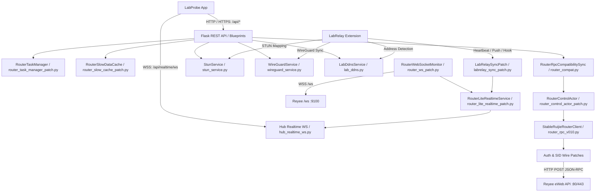
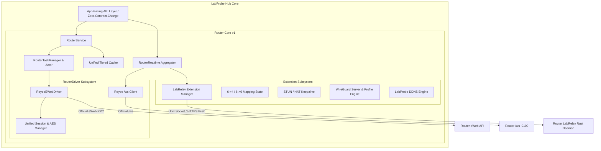

# LabProbe Hub 架构深度审计报告

**代码库**: OnlyChallgener/labprobe-hub (Python 3.10+ / Flask / Gevent / WebSocket / SQLite)  
**审计重点**: `hub.py`, `hub_entry.py`, `router_rpc*.py`, 30 余个猴子补丁 (Monkey Patches), 缓存与调度系统, 数据源收口方案  
**审计性质**: 100% 只读架构审计  
**审计日期**: 2026-08-24  

---

## 一、当前 Hub 真实运行时架构与数据流

当前 Hub 运行时并非单纯的单一服务，而是通过 `hub_entry.py` 在 `hub.py` 启动阶段动态叠加了超过 30 个猴子补丁与适配层：



---

## 二、当前 Patch 完整清单与生命周期分类

在 `hub_entry.py` 中安装的所有补丁，其存在原因、当前是否仍需要、应迁移的目标模块及安全删除时机如下表所示：

| 补丁文件名 | 初始引入原因 (Why Needed) | 当前是否仍需要 | 目标正式模块 (Target Module) | 安全删除条件 (Safe Removal Condition) | 处置分类 |
| :--- | :--- | :--- | :--- | :--- | :--- |
| `router_http_developer_transport_patch.py` | 修正开发机 eWeb 认证流程中的 HTTP/HTTPS 协议与 Origin 头 | 是 (逻辑需保留) | `RouterDriver/ReyeeEWebDriver` | 迁入新 Driver 并通过 eWeb 登录测试后 | **MIGRATE** |
| `router_developer_flow_patch.py` | 捕获并模拟浏览器登录 Reyee eWeb 的真实 key 提取与 AES 握手 | 是 (逻辑需保留) | `RouterDriver/ReyeeEWebDriver` | 统一 Session 认证管理器接管后 | **MIGRATE** |
| `router_be72_auth_patch.py` | BE72 路由器固件特有的 cookie 存储与鉴权重试机制 | 是 (逻辑需保留) | `RouterDriver/ReyeeEWebDriver` | 整合入统一 SessionManager 后 | **MIGRATE** |
| `router_be72_sid_wire_patch.py` | BE72 固件在 URL 参数中强制要求 `?auth=<sid>` 的 Wire 协议修正 | 是 (逻辑需保留) | `RouterDriver/ReyeeEWebDriver` | 整合入统一 RPC 发送层后 | **MIGRATE** |
| `router_native_features_patch.py` | 对接路由器原生 NAT 诊断与 Beta 升级 API 接口参数标准化 | 是 (逻辑需保留) | `RouterService/RouterTasks` | 迁入标准 TaskManager 并完成验收后 | **MIGRATE** |
| `router_ws_patch.py` | 原生接入路由器 `/ws` (fast/slow) 遥测流并解析 CPU/内存/流量 | 是 (核心通道) | `RouterRealtime/ReyeeWSMonitor` | 统一 Realtime 引擎接管后 | **MIGRATE** |
| `router_fast_watchdog_patch.py` | 解决路由器 `/ws fast` 偶发静默卡死，提供 5 秒超时自动重连 | 是 (核心通道) | `RouterRealtime/ReyeeWSMonitor` | 纳入统一 WebSocket 生命周期管理后 | **MIGRATE** |
| `router_ws_passive_fix.py` | 避免高频向路由器 `/ws` 发送被动查询，降低路由器 CPU 负担 | 是 (核心策略) | `RouterRealtime/ReyeeWSMonitor` | 确认新 WSMonitor 完全采用事件/推送驱动后 | **MIGRATE** |
| `router_realtime_stability_patch.py` | 稳定 Dashboard 数据聚合，提供快照合并与冷启动默认值 | 是 (核心逻辑) | `RouterRealtime` | 聚合层统一并在无数据时优雅降级后 | **MIGRATE** |
| `router_build024_fix.py` | 精确微调各硬件字段映射，修复 0.9.24 历史指标字段漂移 | 是 (字段映射) | `RouterRealtime` | 映射关系固化入正式模型并经 Contract 测试后 | **MIGRATE** |
| `router_relay_credentials_patch.py` | 在不恢复旧 Relay dashboard 的前提下提取宽带账号密码 | 是 (读取逻辑) | `RouterService` | 迁入统一 WAN 配置读取模块后 | **MIGRATE** |
| `router_slow_cache_patch.py` | 对低频变动的只读配置引入 SWR (Stale-While-Revalidate) 缓存 | 是 (性能关键) | `RouterCache` | 统一多级缓存系统上线后 | **MIGRATE** |
| `router_control_scheduler_patch.py` | 隔离慢速配置轮询与实时 WSS 协程，防止 Event Loop 阻塞 | 是 (架构关键) | `RouterTasks/Scheduler` | 独立后台任务调度器上线后 | **MIGRATE** |
| `router_control_actor_patch.py` | 单通道优先队列 (Priority Actor)，防止并发 RPC 打崩路由器 CGI | 是 (稳定性关键) | `RouterDriver/ReyeeEWebDriver` | Actor 队列成为 RouterDriver 内置组件后 | **MIGRATE** |
| `router_task_manager_patch.py` | 管理 NAT 诊断、自检、固件升级等耗时异步任务状态机 | 是 (业务逻辑) | `RouterTasks/TaskManager` | 独立 TaskManager 模块化后 | **MIGRATE** |
| `router_compat.py` | 将官方 eWeb 数据结构转换为 LabProbe 既有 App-Facing API 契约 | 是 (契约保证) | `RouterService/Adapter` | 结构转换器成为标准 Service 转换层后 | **MIGRATE** |
| `router_status_localization.py` | 对路由器状态枚举进行本地化与规范化文本转换 | 是 (展示辅助) | `RouterService` | 纳入统一格式化工具后 | **MIGRATE** |
| `router_lite_realtime_patch.py` | 提供轻量数字指标缓存池，供 App 高频轮询/推流快速读取 | 是 (性能关键) | `RouterRealtime/Cache` | 整合入统一实时聚合缓存后 | **MIGRATE** |
| `hub_realtime_ws.py` | 对接 App 的 `/api/realtime/ws`，向下游客户端广播聚合遥测 | 是 (核心入口) | `RouterRealtime/HubWSServer` | 成为统一 Realtime 广播端点后 | **MIGRATE** |
| `router_config_sync_patch.py` | 监测配置哈希变更，有变更时才向 App 发送 WSS 增量通知 | 是 (优化机制) | `RouterRealtime/ConfigSync` | 纳入统一变更分发系统后 | **MIGRATE** |
| `router_device_live_sync_patch.py` | 5 秒定时拉取 `user_list` 并与历史终端数据库进行比对合并 | 是 (设备核心) | `RouterService/DeviceService` | 设备服务正式独立化后 | **MIGRATE** |
| `labrelay_sync_patch.py` | 维持 LabRelay Extension 的在线状态与运行时规则双向同步 | 是 (扩展核心) | `Extension/LabRelayManager` | 成为正式 Extension 管理服务后 | **MIGRATE** |
| `portmap_persistence_patch.py` | 将 6→4 / 6→6 映射规则持久化至 SQLite，重启后自动重新下发 | 是 (数据安全) | `Extension/MappingEngine` | 统一持久化存储管理后 | **MIGRATE** |
| `followup_stability_patch.py` | 0.9.33 稳定性补丁，防并发空指针与重连风暴 | 是 (保护逻辑) | 各对应正式模块 | 代码逻辑迁入并完成压力测试后 | **MIGRATE** |
| `final_stability_patch.py` | 0.9.34 稳定性补丁，强化网络异常下的容错能力 | 是 (保护逻辑) | 各对应正式模块 | 容错逻辑融入核心链路后 | **MIGRATE** |
| `hub0934_fixes.py` / `hub0935_sync_fix.py` | 0.9.34/0.9.35 历史版本边缘场景修复 | 是 (修复逻辑) | 各对应正式模块 | 修复断言写入单元测试并验证后 | **MIGRATE** |
| `router_rpc.py` (旧版客户端) | 0.9.0 初始 RPC 客户端实现 | 否 (被 v0.10 替代) | 无 | **REMOVE-LATER**: 待 RouterCore 上线验证后废弃 | **REMOVE-LATER** |
| `router_rpc_v099.py` (过渡版本) | 0.9.9 过渡期 RPC 客户端 | 否 (被 v0.10 替代) | 无 | **REMOVE-LATER**: 待 RouterCore 上线验证后废弃 | **REMOVE-LATER** |
| `router_rpc_v010.py` | 0.9.12+ 当前正在使用的 RPC 基础实现 | 是 (代码基础) | `RouterDriver/ReyeeEWebDriver` | 重构成标准 Driver 类后 | **MIGRATE** |

---

## 三、识别出的核心技术债务与重复逻辑 (Duplicated Paths)

1. **三套 RPC 客户端共存 (`router_rpc.py`, `router_rpc_v099.py`, `router_rpc_v010.py`)**:
   - 现存 3 个版本的 RPC 客户端，代码重复率高达 70%，包含重复的 AES 加密、JSON 序列化、会话保持与错误码映射。
2. **认证与 Session 猴子补丁层叠**:
   - `router_developer_flow_patch.py`、`router_be72_auth_patch.py`、`router_be72_sid_wire_patch.py` 和 `router_http_developer_transport_patch.py` 四个补丁相互包裹底层 `_raw_api_call` 与 `_login` 函数，调试堆栈深且极其脆弱。
3. **多套独立缓存池**:
   - `RouterSessionCache` (会话缓存)
   - `TinyTtlCache` (RPC 级别 TTL 缓存)
   - `RouterSlowDataCache` (SWR 慢读缓存)
   - `RouterLiteRealtimeService` (实时指标内存缓存)
   - `RouterRpcCompatibilitySync` (内部状态快照)
   - 存在缓存穿透、生命周期不一致和内存重复占用的隐患。
4. **双重数据源采样 (Dashboard / 终端设备)**:
   - 官方 `/ws` 已经提供高频 CPU、内存、温度、WAN 速率；旧逻辑中仍有部分代码保留了向 Relay 轮询 dashboard 的影子通道。
   - 终端设备列表：官方 `user_list` (全量) 与 Relay 采集 (增量) 存在重复拉取，需统一由 `DeviceService` 按需调度。

---

## 四、Router Core v1 目标收拢架构



### 4.1 核心分工边界定义
1. **ReyeeEWebDriver (官方能力承载)**:
   - 负责路由器官方 Web 登录、AES-256-CBC 密码加密、动态 Token/Cookie/SID 保持。
   - 负责通用 Router RPC (`devSta`, `devConfig`, `acConfig`, `devCap`)。
   - 负责原生系统概览、WAN/LAN/IPv6 配置、Wi-Fi 参数、官方端口映射、UPnP 监控、官方 DDNS、重启与系统升级。
   - 负责官方 WebSocket (`/ws`) 实时帧接收与看门狗重连。
2. **LabRelay Extension (自研扩展能力承载)**:
   - 负责 6→4 与 6→6 映射数据平面 (TCP/UDP Relay、IPv6 动态 Suffix+MAC 解析)。
   - 负责 STUN NAT 穿透探测、公网端口保活与动态 Endpoint 上报。
   - 负责 WireGuard VPN 运行时管理、本地私钥安全隔离 (`/etc/labprobe/wireguard/private.key`) 与 Endpoint Profiles 防竞争更新。
   - 负责路由器真实出口 IPv4/IPv6 探测 (赋能 LabProbe DDNS 8 家厂商更新)。
   - 负责 Extension 自身的生命周期与运维 (心跳、版本升级、日志清理、Doctor)。

---

## 五、Reyee 登录认证 Reference Oracle 对照与 SessionManager 约束

针对历史参考 PoC（`api/aes.js` 与 `api/api_test_all.js`），新架构中的 `ReyeeSessionManager` 必须作为标准 Reference Oracle 对照基准进行实现与双向验证：

### 5.1 认证握手与密码加密 Reference 规范
1. **动态 Key 提取**:
   - `GET /cgi-bin/luci/`
   - 正则提取：`GibberishAES\.enc\(passwordEl\.value,\s*"([a-f0-9]+)"\)`
   - 容错处理：若提取失败，按配置重试或回退到标准 eWeb 默认 key。
2. **OpenSSL / GibberishAES 兼容密文生成**:
   - **算法与模式**: AES-256-CBC，填充标准为 PKCS#7。
   - **KDF 密钥派生**: OpenSSL `EVP_BytesToKey` (MD5 Hash 迭代，Key 长度 32 字节 / 256 位，IV 长度 16 字节 / 128 位)。
   - **Salt 格式**: 前缀 `b"Salted__"` + 8 字节随机 Salt。
   - **编码**: Base64 编码，**强制去除所有换行与空白字符** (`.replace(/\s+/g, '')`)。
   - **非确定性与测试约束**: GibberishAES 正常加密时每次生成随机 8 字节 Salt，因此**正常运行时不要求同一明文/Key 的密文字节完全相同**。要求满足：OpenSSL `Salted__` wire 格式兼容、`EVP_BytesToKey(MD5)` 兼容、AES-256-CBC 兼容、PKCS#7 兼容，以及 **JS 与 Python 双向互解验证**。只有在**固定 Test Salt 的确定性测试用例 (Deterministic Test Vectors)** 下，才要求产出逐字节完全相同的密文。
3. **登录鉴权调用**:
   - `POST /cgi-bin/luci/api/auth`
   - Headers: `Content-Type: application/json`
   - Request Body:
     ```json
     {
       "method": "login",
       "params": {
         "username": "admin",
         "time": "<epoch_seconds_string>",
         "encry": true,
         "pwd": "<encrypted_password_base64>",
         "isCheckReadAgreement": "true"
       }
     }
     ```
4. **Session 与 Cookie 绑定**:
   - 成功响应：`root.data.token`、`root.data.sid`、`root.data.sn`、`root.data.sessiontime`。
   - 提取响应头 `Set-Cookie`（如 `sysauth=<sid>`）。
5. **后续 RPC 携带规则 (Wire Protocol)**:
   - **URL Path**: `/cgi-bin/luci/api/cmd?auth=<sid>` (或对应 API 路径带 `?auth=<sid>`)。
   - **Headers**: 必须包含 `Cookie: <cookieHeader>` 与 `Content-Type: application/json`。
   - **Body**: `{"method": "<method_name>", "params": <params_object>}`。

### 5.2 Session Timeout 与 Idle Timeout 行为准则
- **Idle Timeout 模型**: 锐捷 eWeb 返回的 `sessiontime` 属于**空闲超时（Idle Timeout）**，每一次成功的鉴权 RPC 调用都会在固件服务端刷新该 Session 的最后活跃时间戳（`atime`）。
- **严禁按固定时长主动重登**: 绝不得因“登录后经过了 N 分钟”而主动废弃有效 Session 进行盲目重登。
- **`ReyeeSessionManager` 的核心生命周期策略**:
  1. **正常复用**: 默认持久复用已验证有效的 SID 与 CookieJar。
  2. **双重失效识别**: 同时捕获 HTTP 传输层状态码（`401 Unauthorized` / `403 Forbidden`）以及 RPC/应用层会话失效报文（如响应 JSON 中 `{code: 401}`、`"session invalid"` 或鉴权错误）。
  3. **Single-Flight 独占重登录**: 当检测到 Session 失效时，必须采用 **Single-Flight 并发锁**，同一时刻仅允许一个协程/线程发起 `/api/auth` 登录请求，其他并发请求阻塞挂起并直接复用新产出的 Session，**严禁并发请求同时触发多个登录风暴**。
  4. **失败请求至多自动重试一次**: 原触发 Session 失效的业务请求，在 Single-Flight 重新鉴权成功后，**最多自动重试 1 次**；若重试依然失败，立即向上抛出错误。
  5. **防无限死循环熔断 (Circuit Breaker)**: 若连续鉴权失败（如密码变更错误），必须触发重试熔断与退避，防止陷入无限鉴权死循环。

### 5.3 Fail-Closed 凭据安全规范
- **Reference Oracle 严格 Fail-Closed**: `api/api_test_all.js` 必须从环境变量（`ROUTER_IP` 与 `ROUTER_PASSWORD`）获取凭据；若任一缺失，必须直接中断退出 (`process.exit(1)`)，**严禁使用任何默认明文占位符 fallback**。
- **凭据零泄露**: 严禁将任何真实设备 IP、用户名、密码或 Token 写入 Git 仓库、持久化日志文件或单元测试 Fixtures 中。
